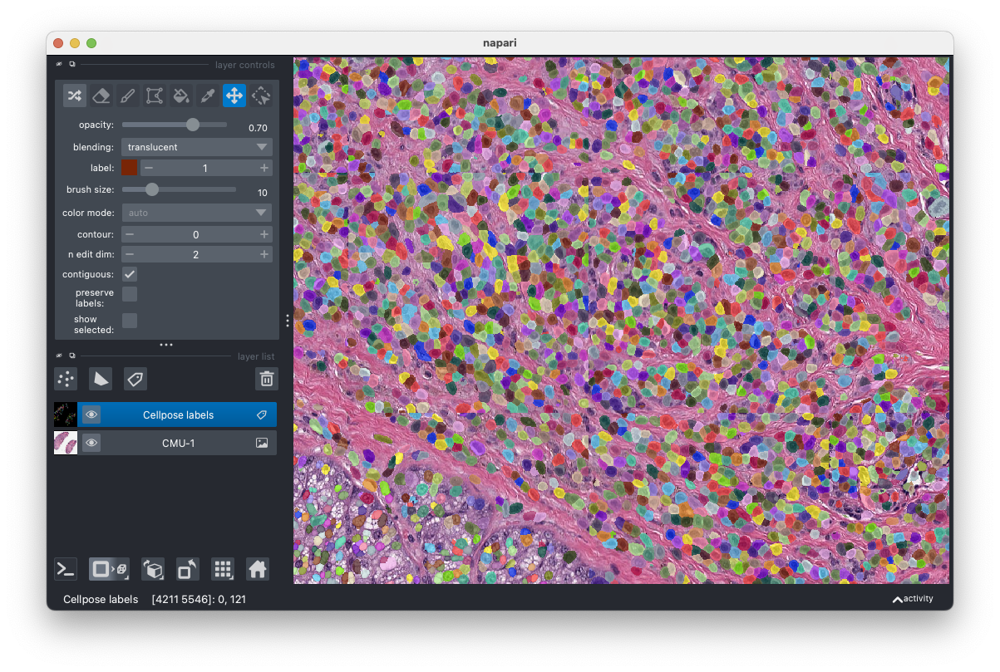

# Optional: view data using napari

Instead of using matplotlib to visualize images, there are a number of alternatives for viewing zarr data.
For example, you can use [napari](https://napari.org/) a Python viewer for n-dimensional images.

You can install napari along with a Qt backend using your preferred Python package manager, for example using conda:
```bash
conda create -n napari-env -c conda-forge python=3.11 napari pyqt napari-ome-zarr
conda activate napari-env
```
In the command above we are also installing the [napari-ome-zarr](https://github.com/ome/napari-ome-zarr) plugin to facilitate accessing the miroscopy (OME) metadata from the zarr files.

In this case, you can simply launch napari from the command line and open the remote zarr image using:
```bash
napari https://storage.googleapis.com/jax-public-ngff/example_v2/CMU-1_Crop.ome.zarr/0
```
Note the `/0` at the end of the path, indicating that napari should open the first (and only in this case) image multiscale/pyramid group. You can also subsitute the path to your local copy of `CMU-1_Crop.ome.zarr`, making sure to append the `/0`.

Once the viewer loads, you can then drag-and-drop the labels zarr folder (`CMU-1_Crop_labels_cellpose_cyto3.zarr`) into the napari viewer to add the labels layer. When prompted, select `napari-ome-zarr` plugin. Once the layer loads, you will need to right-click on the labels layer (named "C") in the layer list on the left side of the viewer and select "Convert to labels" to get the correct rendering of the labels.

After zooming in a bit, you should see something like this:


Or you can do it programmatically as follows:
```python
import napari

# path to the first (only) image multiscale/pyramid group
# again, you can replace the URL with your local path
img_path = "https://storage.googleapis.com/jax-public-ngff/example_v2/CMU-1_Crop.ome.zarr/0"
labels_path = "path/to/CMU-1_Crop_labels_cellpose_cyto3.zarr"

# create a napari viewer
viewer = napari.Viewer()

viewer.open(img_path, plugin="napari-ome-zarr")
viewer.open(labels_path, plugin="napari-ome-zarr", layer_type="labels")
```
Note: If you want to run this snippet as a script, append `napari.run()` at the end of the script to start the napari event loop.

Final tip: if you want to use napari with full size whole-slide images or remote zarr data, we recommend using the "Render Images Asynchronously" option in napari settings (under "Experimental"). You can also set this using the environment variable `NAPARI_ASYNC=1`, e.g.:

```bash
NAPARI_ASYNC=1 napari https://storage.googleapis.com/jax-public-ngff/example_v2/CMU-1_Crop.ome.zarr/0
```
